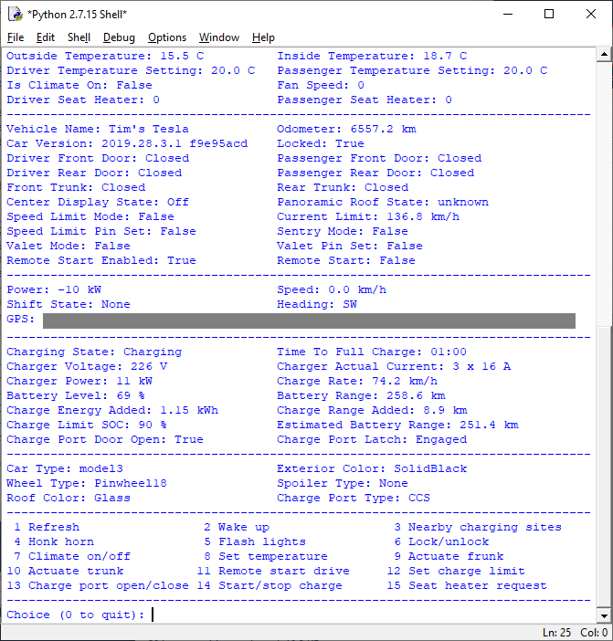
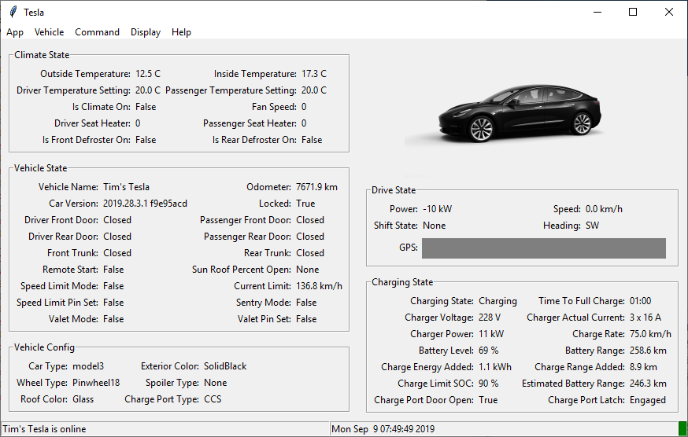

# TeslaPy

A Python implementation based on [unofficial documentation](https://tesla-api.timdorr.com/) of the client side interface to the Tesla Motors Owner API, which provides functionality to monitor and control Tesla vehicles remotely.

## Overview

The single file module *teslapy* depends on Python [requests](https://pypi.org/project/requests/) and [requests_oauthlib](https://pypi.org/project/requests-oauthlib/). The `Tesla` class extends `requests.Session` and therefore inherits methods like `get()` and `post()` that can be used to perform API calls. It uses Tesla's new [OAuth 2](https://oauth.net/2/) Single Sign-On service with support for Multi-Factor Authentication (MFA) Time-based One-Time Passwords (TOTP) to acquire a JSON Web Token (JWT) bearer to access the Owner API that is cached to disk (*cache.json*) for reuse. The cache stores tokens of each authorized identity (email). Authentication is only needed when a new token is requested. The token is automatically refreshed when expired without the need to reauthenticate. An email registered in another region (e.g. auth.tesla.cn) is also supported. The constructor takes two arguments required for authentication (email and password) and three optional arguments: a passcode getter function, a factor selector function and a proxy server URL. The convenience method `api()` uses named endpoints listed in *endpoints.json* to perform calls, so the module does not require changes if the API is updated. Any error message returned by the API is raised as an `HTTPError` exception. Additionally, the class implements the following methods:

| Call | Description |
| --- | --- |
| `fetch_token()` | requests a new JWT bearer token using Authorization Code grant with [PKCE](https://oauth.net/2/pkce/) extension |
| `refresh_token()` | requests a new JWT bearer token using [Refresh Token](https://oauth.net/2/grant-types/refresh-token/) grant |
| `vehicle_list()` | returns a list of Vehicle objects |

The `Vehicle` class extends `dict` and stores vehicle data returned by the API. Additionally, the class implements the following methods:

| Call | Description |
| --- | --- |
| `api()` | performs an API call to named endpoint requiring vehicle_id with optional arguments |
| `get_vehicle_summary()` | gets the state of the vehicle (online, asleep, offline) |
| `sync_wake_up()` | wakes up and waits for the vehicle to come online |
| `option_code_list()` | lists known descriptions of the vehicle option codes |
| `get_vehicle_data()` | gets a rollup of all the data request endpoints plus vehicle config |
| `get_nearby_charging_sites()` | lists nearby Tesla-operated charging stations |
| `mobile_enabled()` | checks if mobile access is enabled in the vehicle |
| `compose_image()` | composes a vehicle image based on vehicle option codes |
| `dist_units()` | converts distance or speed units to GUI setting of the vehicle |
| `temp_units()` | converts temperature units to GUI setting of the vehicle |
| `decode_vin()` | decodes the vehicle identification number to a dict |
| `remote_start_drive()` | enables keyless drive (requires password to be set) |
| `command()` | wrapper around `api()` for vehicle command response error handling |

Only `get_vehicle_summary()`, `option_code_list()`, `compose_image()` and `decode_vin()` are available when the vehicle is asleep or offline. These methods will not prevent your vehicle from sleeping. Other methods and API calls require the vehicle to be brought online by using `sync_wake_up()` and can prevent your vehicle from sleeping if called with too short a period.

## Usage

Basic usage of the module:

```python
import teslapy
with teslapy.Tesla('elon@tesla.com', 'starship') as tesla:
	tesla.fetch_token()
	vehicles = tesla.vehicle_list()
	vehicles[0].sync_wake_up()
	vehicles[0].command('ACTUATE_TRUNK', which_trunk='front')
```

The constructor requires a function that returns a passcode string as the third argument in case your Tesla account has MFA enabled:

```python
with teslapy.Tesla('elon@tesla.com', 'starship', lambda: '123456') as tesla:
```

Tesla allows you to enable more then one MFA device. In this case the constructor requires a function that takes a list of dicts as an argument and returns the selected factor dict as the fourth argument. The function may return the selected factor name as well:

```python
with teslapy.Tesla('elon@tesla.com', 'starship', lambda: '123456', lambda _: 'Device #1') as tesla:
```

Take a look at *menu.py* or *gui.py* for examples of a passcode getter function and a factor selector function.

These are the major commands:

| Endpoint | Parameters | Value |
| --- | --- | --- |
| UNLOCK | | |
| LOCK | | |
| HONK_HORN | | |
| FLASH_LIGHTS | | |
| CLIMATE_ON | | |
| CLIMATE_OFF | | |
| MAX_DEFROST | `on` | `true` or `false` |
| CHANGE_CLIMATE_TEMPERATURE_SETTING | `driver_temp`, `passenger_temp` | temperature in celcius |
| CHANGE_CHARGE_LIMIT | `percent` | percentage |
| CHANGE_SUNROOF_STATE | `state` | `vent` or `close` |
| WINDOW_CONTROL <sup>1</sup> | `command`, `lat`, `lon` | `vent` or `close`, `0`, `0` |
| ACTUATE_TRUNK | `which_trunk` | `rear` or `front` |
| REMOTE_START | `password` | password |
| TRIGGER_HOMELINK | `lat`, `lon` | current lattitude and logitude |
| CHARGE_PORT_DOOR_OPEN | | |
| CHARGE_PORT_DOOR_CLOSE | | |
| START_CHARGE | | |
| STOP_CHARGE | | |
| MEDIA_TOGGLE_PLAYBACK | | |
| MEDIA_NEXT_TRACK | | |
| MEDIA_PREVIOUS_TRACK | | |
| MEDIA_NEXT_FAVORITE | | |
| MEDIA_PREVIOUS_FAVORITE | | |
| MEDIA_VOLUME_UP | | |
| MEDIA_VOLUME_DOWN | | |
| SET_VALET_MODE | `on`, `password` | `true` or `false`, 4 digit PIN |
| RESET_VALET_PIN | | |
| SPEED_LIMIT_ACTIVATE | `pin` | 4 digit PIN |
| SPEED_LIMIT_DEACTIVATE | `pin` | 4 digit PIN |
| SPEED_LIMIT_SET_LIMIT | `limit_mph` | between 50-90 |
| SPEED_LIMIT_CLEAR_PIN | `pin` | 4 digit PIN |
| SCHEDULE_SOFTWARE_UPDATE | `offset_sec` | seconds |
| CANCEL_SOFTWARE_UPDATE | | |
| SET_SENTRY_MODE | `on` | `true` or `false` |
| REMOTE_SEAT_HEATER_REQUEST | `heater`, `level` | seat 0-5, level 0-3 |
| REMOTE_STEERING_WHEEL_HEATER_REQUEST | `on` | `true` or `false` |

<sup>1</sup> `close` requires `lat` and `lon` values to be near the current location of the car.

## Exceptions

Basic exception handling:

```python
    try:
        vehicles[0].command('HONK_HORN')
    except teslapy.HTTPError as e:
        print(e)
```

All `requests.exceptions` classes are imported by the module. When the vehicle is asleep or offline and the vehicle needs to be online for the API endpoint to be executed, the following exception is raised: `requests.exceptions.HTTPError: 408 Client Error: vehicle unavailable`. The exception can be caught as `teslapy.HTTPError`.

Additionally, `sync_wake_up()` raises `teslapy.VehicleError` when the vehicle does not come online within the specified timeout. And `command()` also raises `teslapy.VehicleError` when the vehicle command response result is `False`. For instance, if one of the media endpoints is called and there is no user present in the vehicle, the following exception is raised: `VehicleError: user_not_present`.

## Applications

*cli.py* is a simple CLI application that can use almost all functionality of the TeslaPy module. The filter option allows you to select a vehicle if more than one vehicle is linked to your account. API output is JSON formatted:

```
usage: cli.py [-h] -e EMAIL [-p [PASSWORD]] [-t PASSCODE]  [-u FACTOR] [-f FILTER] [-a API]
              [-k KEYVALUE] [-c COMMAND] [-l] [-o] [-v] [-w] [-g] [-n] [-m] [-s] [-d]

Tesla Owner API CLI

optional arguments:
  -h, --help     show this help message and exit
  -e EMAIL       login email
  -p [PASSWORD]  prompt/specify login password
  -t PASSCODE    two factor passcode
  -u FACTOR      use two factor device name
  -f FILTER      filter on id, vin, etc.
  -a API         API call endpoint name
  -k KEYVALUE    API parameter (key=value)
  -c COMMAND     vehicle command endpoint
  -l, --list     list all selected vehicles
  -o, --option   list vehicle option codes
  -v, --vin      vehicle identification number decode
  -w, --wake     wake up selected vehicle(s)
  -g, --get      get rollup of all vehicle data
  -n, --nearby   list nearby charging sites
  -m, --mobile   get mobile enabled state
  -s, --start    remote start drive
  -d, --debug    set logging level to debug
```

Example usage of *cli.py* using a cached token:

`python cli.py -e elon@tesla.com -w -a ACTUATE_TRUNK -k which_trunk=front`

*menu.py* is a menu-based console application that displays vehicle data in a tabular format. The application depends on [geopy](https://pypi.org/project/geopy/) to convert GPS coordinates to a human readable address:



*gui.py* is a graphical interface using `tkinter`. API calls are performed asynchronously using threading. The GUI also supports auto refreshing of the vehicle data and the GUI displays a composed vehicle image. Note that the vehicle will not go to sleep, if auto refresh is enabled. The application depends on [pillow](https://pypi.org/project/Pillow/) to display the vehicle image, if the Tcl/Tk GUI toolkit version of your Python installation is 8.5. Python 3.4+ should include Tcl/Tk 8.6, which natively supports PNG image format and therefore has no such dependency.



## Installation

Make sure you have [Python](https://www.python.org/) 2.7+ or 3.5+ installed on your system. Install [requests](https://pypi.org/project/requests/) with [requests_oauthlib](https://pypi.org/project/requests-oauthlib/) and [geopy](https://pypi.org/project/geopy/) using [PIP](https://pypi.org/project/pip/) on Linux or macOS:

`pip install requests_oauthlib geopy`

or on Windows as follows:

`python -m pip install requests_oauthlib geopy`

or on Ubuntu as follows:

`sudo apt-get install python3-requests-oauthlib python3-geopy`

Copy directory *teslapy* and files *cli.py*, *menu.py* and *gui.py* to your machine and run *cli.py*, *menu.py* or *gui.py* to get started.
